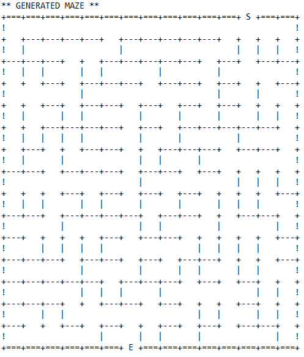
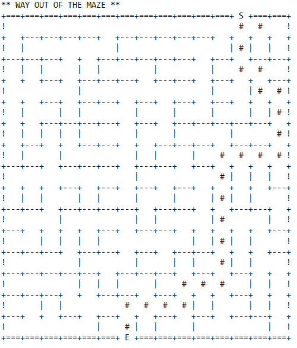
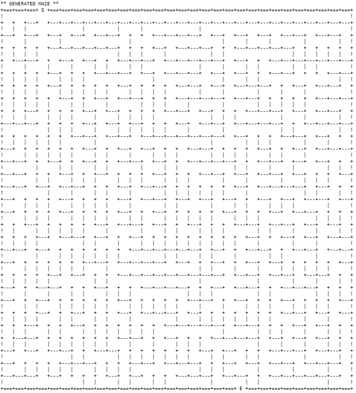
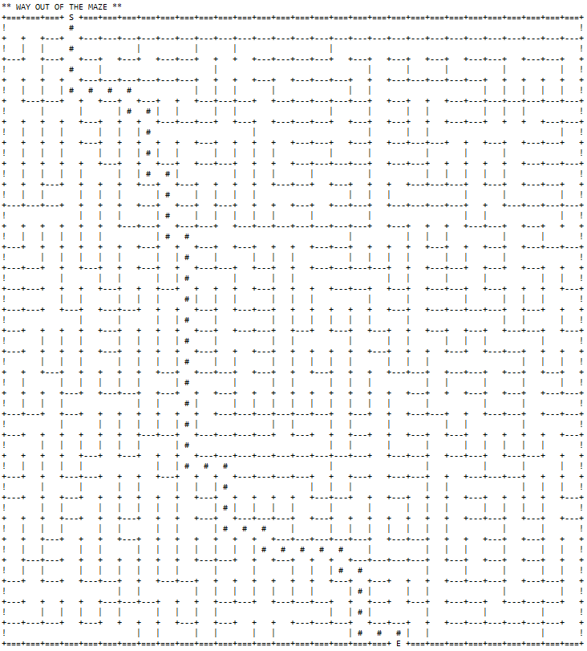

# maze-generator
ASCII maze generator written in Java.

The program generates maze of given size, and can also solve it finding shortest way out. 

## Example mazes

Maze of size 15

Maze of size 30

